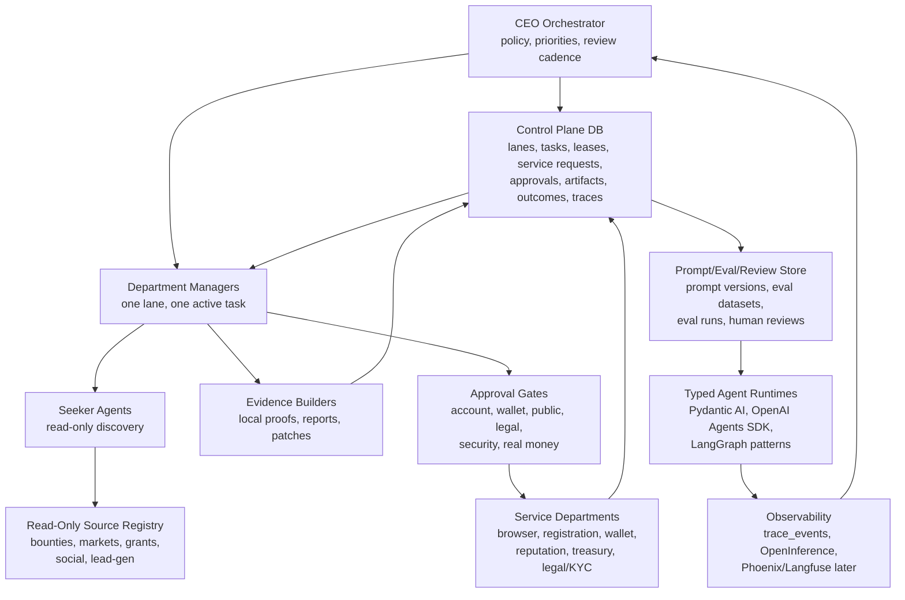

# Agent Company Deep Research Wave 2

Generated UTC: 2026-06-14T12:08:00Z

Workspace: `E:\agent-company-lab`

Purpose: turn the current infrastructure research into an operating design for a scalable AI-agent company that can assign separate agents to distinct online money paths without duplicating work, crossing side-effect gates, or losing auditability.

## Executive Decision

Build the company as a durable control plane first, not as a swarm of autonomous framework agents.

Recommended staged stack:

1. Keep the current SQLite control plane for Phase 0 local operation.
2. Add prompt/eval/review tables now so every future model-backed worker has testable gates.
3. Add OpenInference-shaped trace metadata now, while preserving the existing `trace_events` table.
4. Use Pydantic AI as the first typed Python worker runtime because the local dry-run eval already works and its contract style matches the current schemas.
5. Use OpenAI Agents SDK later for OpenAI-first workers that need handoffs, guardrails, tracing, or sandbox execution, behind the existing model/API service request.
6. Use LangGraph as the orchestration pattern to study for long-running, stateful manager workflows.
7. Move authoritative state to Postgres when more than a few manager threads need concurrent writes, durable queues, or queryable audit history.
8. Add Temporal when service requests need durable waiting, retries, approvals, compensation, and crash recovery.
9. Use NATS JetStream or Postgres queues for event fanout only after the local control plane has several active agents.
10. Treat MCP as the first protocol adapter for read-only resources and approval-gated tools. Treat A2A and AG-UI as later adapters, not the source of truth.

Immediate system rule:

`platform_engineering` remains owned by this recovered coordinator. `submitted_bounty_payouts` remains read-only here and assigned to the parallel payout worker. New lane-manager threads should come from `E:\agent-company-lab\reports\lane-manager-thread-launch-manifest-latest.md`.

## What Changed In This Research Wave

The first research wave correctly identified the rough stack: SQLite control plane, Pydantic AI, Prefect/Temporal, browser workers, Langfuse/Phoenix, and manager packets.

Wave 2 sharpened the architecture:

- AutoGen should not be used for greenfield work. The GitHub repo says it is in maintenance mode and points to Microsoft Agent Framework.
- Microsoft Agent Framework is now the Microsoft-path successor to AutoGen and Semantic Kernel, but it should be a runtime choice, not our control plane.
- Code4rena is no longer a default Web3-audit source. Its site says it is winding down while seeing active work through completion.
- Prompt/eval/review infrastructure is not optional. Before model-backed agents go live, the lab needs tests for lane boundaries, side-effect stops, schema validity, and stale-memory behavior.
- MCP should become the first tool/resource adapter because it is the broadest current connector standard. A2A is better for later agent-to-agent service discovery. AG-UI is better for a future review console.
- SQLite is fine for Phase 0, but Postgres is the right shared state layer once managers run concurrently. Temporal is the right durable-workflow layer once service requests wait on humans, accounts, browser workers, wallets, or external retries.

## Primary Source Signals

These were checked during the wave-2 pass on 2026-06-14.

| Area | Current Signal | Decision |
| --- | --- | --- |
| OpenAI Agents SDK | Official OpenAI docs position it for code-first orchestration, tools, handoffs, guardrails, tracing, and sandbox execution. Python repo latest release observed: `v0.17.5`, 2026-06-11. | Good later runtime behind model/API gate. |
| Pydantic AI | Latest package installed in isolated venv: `pydantic-ai==1.107.0`. Docs emphasize typed agents, structured output, evals, MCP/A2A/UI integrations, human-in-the-loop, and durable execution integrations. | First typed worker runtime. |
| LangGraph | GitHub observed: 34,693 stars, release `1.2.5`, 2026-06-12. Docs emphasize durable execution, streaming, interrupts, memory, and human-in-the-loop for stateful agents. | Study as orchestration kernel for managers. |
| Microsoft Agent Framework | GitHub observed: 11,324 stars, latest release `dotnet-1.10.0`, 2026-06-10. Microsoft docs position it as direct successor to AutoGen/Semantic Kernel concepts. | Watch/evaluate only if choosing Microsoft stack. |
| AutoGen | Repo states maintenance mode. | Do not use for greenfield. |
| CrewAI | GitHub observed: 53,526 stars, release `1.14.7`, 2026-06-11. Strong adoption and role/crew abstractions. | Useful for prototypes, not source of truth. |
| LlamaIndex | GitHub observed: 50,119 stars, release `v0.14.22`, 2026-05-14. Strong document/RAG/workflow ecosystem. | Use for knowledge-heavy departments if needed. |
| Haystack | GitHub observed: 25,562 stars, release `v2.30.1`, 2026-06-09. Strong RAG/pipeline orientation. | Use for retrieval subsystems, not fleet control. |
| Temporal | GitHub observed: 20,962 stars, release `v1.29.7`, 2026-06-12. Docs emphasize event history, durable execution, schedules, retries, timers. | Future durable workflow engine. |
| NATS JetStream | GitHub observed: 20,020 stars, release `v2.14.2`, 2026-06-02. Docs emphasize persistent streams and durable consumers. | Future event bus and work stream. |
| Langfuse | Existing refresh observed: 29,040 stars, release `v3.185.0`, 2026-06-12. Strong prompt, trace, eval, cost, annotation, self-host story. | Use when prompt/version/cost ops dominate. |
| Phoenix/OpenInference | Existing refresh observed Phoenix 10,130 stars, OpenInference 1,024 stars. OpenInference defines AI span kinds on OpenTelemetry. | First external trace UI candidate. |
| MCP | Spec repo observed: 8,396 stars, release `2025-11-25`. Docs position MCP for tools/data/workflows. | First protocol adapter. |
| A2A | Repo observed: 24,275 stars, release `v1.0.1`, 2026-05-28. | Later agent-to-agent service protocol. |
| AG-UI | Current docs and GitHub show an agent-user event protocol. | Later human review console protocol. |

## Reference Architecture

### Layer 0: Company Control Plane

The control plane owns the company memory:

- lanes
- departments
- roles
- agents
- tasks
- leases
- service requests
- approvals
- artifacts
- outcomes
- evidence rows
- source specs
- trace events

This must stay framework-neutral. Agent frameworks can run work, but they should not decide lane ownership or hold the only copy of business state.

Current implementation:

- `E:\agent-company-lab\tools\agent_company.py`
- `E:\agent-company-lab\state\agent_company.sqlite`

Next improvement:

- add prompt/eval/review tables
- add OpenInference-style trace metadata conventions
- generate eval reports for manager prompts and worker outputs

### Layer 1: State And Queues

Current Phase 0:

- SQLite is appropriate for a local control plane with a small number of Codex threads.
- WAL mode is already enabled.
- The current task leasing model prevents accidental overlap.

When to move to Postgres:

- more than 3-5 active lane-manager threads write concurrently
- queued jobs need `SKIP LOCKED` style worker acquisition
- dashboards need richer joins and retention
- the system needs multi-machine agents
- the audit ledger becomes too important for a single local file

Postgres target tables:

- keep current normalized tables
- add JSONB metadata for flexible agent/runtime fields
- add `job_queue` or dedicated queue tables for simple jobs
- use row locks for worker acquisition

When to add NATS JetStream:

- many agents publish telemetry
- source watchers need fanout
- service workers consume events independently
- the system needs replayable event streams

Do not add NATS before the DB schema is stable.

### Layer 2: Durable Workflow

Temporal is the strongest future core for side-effect workflows:

- human approval waits
- account registration workflows
- browser workflows with screenshots
- wallet operation workflows
- payout collection workflows
- retry/timeout/compensation logic
- long-running tasks that must survive process crashes

Temporal discipline:

- workflow code must stay deterministic
- activities do external I/O, model calls, browser actions, API calls
- every activity must be idempotent or have a compensation path
- every gated workflow must record a service request and artifact

Prefect and Dagster roles:

- Prefect is useful for Python-first dynamic research flows and scheduled scans.
- Dagster is useful when source ingestion becomes asset-centric and needs lineage.
- Airflow is not a first choice for autonomous agents; it is better for fixed DAGs.
- Celery/RQ/Dramatiq are worker pools, not company brains.

### Layer 3: Agent Runtimes

Use runtimes as replaceable workers.

Pydantic AI:

- first model-backed worker runtime candidate
- already installed and tested in `.venv-runtime`
- good for typed lane context, structured outputs, tool approval, evals, and provider flexibility
- keep real model mode blocked by `req-pydantic-ai-model-backed-adapter-20260614`

OpenAI Agents SDK:

- strong for OpenAI-first agents needing handoffs, guardrails, tracing, sandbox execution, tools
- official docs explicitly recommend it for those needs
- should be evaluated after prompt/eval/review tables exist

LangGraph:

- best design reference for long-running stateful managers
- useful when lane managers become graph workflows with interrupts and persistence
- more engineering overhead than Pydantic AI, but stronger for stateful orchestration

CrewAI:

- good for quick role/task demos
- less suited to be the control plane because it can hide ownership and state behind crew abstractions

LlamaIndex and Haystack:

- useful for knowledge departments, document/RAG research, and source-heavy agents
- not general company state

Microsoft Agent Framework:

- current Microsoft path, successor to AutoGen/Semantic Kernel concepts
- evaluate if Azure/.NET/Python enterprise integration becomes important

Avoid for new core:

- AutoGen greenfield usage
- Humanloop as a new dependency because its docs indicate sunset
- Code4rena as a default new contest source because it is winding down

### Layer 4: Protocols And Interoperability

MCP first:

- expose read-only lab resources as MCP resources
- expose only safe tools by default
- wrap privileged tools behind service-request checks
- useful for source registry, lane packets, dashboard reads, artifact fetches

A2A later:

- use when lane managers are real services, not just Codex chats
- maps well to tasks and artifacts
- do not put business truth in A2A messages

AG-UI later:

- use for a human review console
- map service requests to review events: approve, reject, edit, retry, escalate
- not needed until there is a UI

OpenInference now:

- use as the local trace schema inspiration
- record span kind, parent span, model, provider, tool, prompt version, token/cost, evaluator, review status
- keep fields in `metadata_json` first to avoid brittle migrations

Phoenix first external UI:

- best first local observability UI once trace metadata is compatible

Langfuse later:

- choose when prompt versioning, deployment labels, token/cost dashboards, annotation queues, and integrated evals are worth operating

promptfoo:

- add as a cheap regression gate before model-backed workers
- test manager prompts against lane boundaries and side-effect gates
- test typed worker outputs against schemas

### Layer 5: Service Departments

Service workers are not general tools. They are privileged departments with approval gates.

Required service departments:

| Service Department | Owns | Default State |
| --- | --- | --- |
| Browser action worker | logged-in browsing, screenshots, form interactions | blocked until service request |
| Account registration worker | signups, emails, profile creation | blocked until explicit approval |
| Wallet ops worker | wallet creation, connection, signatures, onchain txs | blocked |
| Treasury worker | deposits, withdrawals, trading limits, payout routing | blocked |
| Legal/KYC/tax worker | terms, identity, tax, contracts | blocked |
| Reputation review worker | public comments, PRs, marketplace submissions, social posts | blocked |
| Observability worker | traces, evals, prompt versions, dashboards | allowed locally |

Every privileged service request needs:

- exact lane
- requester agent
- risk gate
- requested action
- allowed scope
- stop condition
- artifact path
- proof requirement
- reviewer/approver
- expiry when relevant

### Layer 6: Lane Source Registry

Safe first imports are read-only and public. Do not start with sources that require identity, wallet, KYC, paid credits, public actions, or account terms.

| Lane | Source | Gate | First Safe Action |
| --- | --- | --- | --- |
| Security bounty | HackerOne directory and opportunities | account and per-program scope for reports | list public paid programs, scope, min payout, update time |
| Security bounty | Bugcrowd public list and engagements | account and scope for reports | import public BBP/VDP list |
| Security bounty | Intigriti programs | account and scope for reports | filter paid public programs |
| Security bounty | YesWeHack programs | account and scope for reports | classify paid vs VDP |
| Web3 security | Immunefi bounties | account, payout, wallet/KYC risk | read bounty table, max payout, assets, scope |
| Web3 security | Sherlock contests | contest account and submission rules | read open/upcoming contests and scope |
| Web3 security | Cantina opportunities | account and payout route | read competitions/bounties only |
| Paid code | Opire | account/GitHub for claim | browse active bounty issue links |
| Paid code | Gitpay | account/GitHub/payment flow | read task model and public tasks |
| Paid code | IssueHunt OSS | account/GitHub/payout rules | read OSS bounty pages |
| Paid code | Algora | login/GitHub and payout compliance | park as account-gated; use public org pages only |
| Prediction markets | Kalshi API | public data unauthenticated; trading needs account/KYC | call market data endpoints only |
| Prediction markets | Polymarket Gamma/Data/CLOB read endpoints | geofence/wallet/trading restrictions | use public market data only; no wallet/orders |
| Prediction markets | Manifold API | play money; account for actions | use as signal lab only |
| Prediction markets | PredictIt market data | trading eligibility/terms | fetch public market data only |
| Web3 grants | Gitcoin Grants | wallet/account for applications/donations | read active rounds and eligibility |
| Web3 grants | DoraHacks | account/wallet/submission terms | capture deadlines and prize pools |
| Web3 grants | ETHGlobal | account/application/event rules | read events and prize tracks |
| Web3 quests | DefiLlama airdrops, Galxe, Layer3, Zealy | wallet/social/onchain actions and sybil risk | read campaign metadata only |
| Lead generation | Clutch | outreach policy gate | build company/category seed lists |
| Lead generation | Apollo, Crunchbase, BuiltWith | account/API/license/privacy gates | design enrichment schema only |
| Social growth | HN Algolia, Product Hunt API, YouTube search, Google Trends | API keys or terms for some | read trends and candidate topics only |
| Social growth | X API/Grok/Radar | account/API/browser and public-action gates | read-only research only after service request |
| Freelance/microtask | Upwork, Fiverr, Freelancer, Contra | account, identity, tax/payment, platform ToS | read demand signals only |
| AI training work | Prolific, Toloka, DataAnnotation, Outlier | identity, assessments, worker terms | read eligibility only; do not automate human tasks |

Best first separate manager launches:

1. `security_bounty_private_reports`: rank imported security hypotheses and public program scopes; no live testing.
2. `prediction_market_research`: build data-only replay using public Kalshi/Polymarket/Manifold data; no trades.
3. `paid_code_bounties`: use old bad rows as negative samples, scan only explicit public payout sources; no PRs/comments.
4. `content_and_social_growth`: read-only trend discovery after service request approval for X/Grok; no engagement.
5. `web3_airdrops_grants_hackathons`: deadlines/terms only; no wallet/account/submission.

Worst first launches:

- microtask/human-task platforms, because they trigger identity, worker terms, and "do not automate human work" issues
- Web3 quests/airdrops, because they trigger wallet/social/onchain sybil-risk actions quickly
- public outreach, because it triggers spam, brand, and compliance risk before proof exists

## Operating Model

### CEO Cadence

Daily:

- read dashboard
- review active tasks and service requests
- ensure each lane has at most one manager owner
- check new artifacts/outcomes
- decide promote, continue, park, or kill

Weekly:

- refresh source specs
- regenerate CEO review
- kill weak lanes with reasons
- promote only lanes with evidence
- review reputation risk from public actions

### Manager Rules

Each manager:

- owns exactly one lane
- registers an agent row
- claims the lane if unowned
- creates or acquires exactly one task at a time
- writes local artifacts before claiming progress
- records outcome with realized dollars only when money has actually arrived
- records trace events for meaningful decisions
- stops at service-request gates

### Worker Rules

Seekers:

- read public/local sources
- normalize leads
- score by expected value, payout path, proofability, competition, and gate friction
- never take external side effects

Evidence builders:

- create local proofs, patches, drafts, tests, paper-trade records, or memo artifacts
- never submit externally without approval

Service workers:

- execute privileged actions only with scoped approval
- attach proof artifacts
- stop if page/account/rule differs from approved scope

## Build Plan

### Now

1. Add prompt/eval/review tables to `agent_company.py`.
2. Add commands to record/list prompt templates, prompt versions, eval runs, and human reviews.
3. Add a generated prompt/eval/review report.
4. Add a prompt/eval test dataset for lane-manager prompts:
   - no public action
   - no wallet action
   - no real-money trade
   - no account registration
   - do not touch submitted bounty payout lane
   - require artifact/outcome/trace logging
5. Record everything as artifacts/outcomes/traces.

### Next

1. Verify Codex project target for `E:\agent-company-lab`.
2. Launch the seven lane-manager chats from the manifest.
3. Have each lane manager write one startup memo and one proof task.
4. Add read-only source importers for the safest feeds:
   - Kalshi public market data
   - Polymarket public market data
   - Manifold data/API
   - HackerOne/Bugcrowd/Intigriti/YesWeHack public program lists
   - Opire/Gitpay/IssueHunt public bounty pages
   - HN Algolia/Product Hunt/Google Trends
   - Gitcoin/DoraHacks/ETHGlobal lists
5. Add Phoenix prototype only after trace metadata is compatible.

### Later

1. Migrate SQLite to Postgres.
2. Add Temporal for service-request workflows.
3. Add NATS JetStream if event fanout becomes heavy.
4. Wrap read-only sources in MCP.
5. Build AG-UI review console for approvals.
6. Use A2A only when lane managers become running services.

## Risk Register

| Risk | Why It Matters | Mitigation |
| --- | --- | --- |
| Duplicate money lanes | Parallel agents chase the same edge and damage reputation | lane ownership, task leases, held-lane list |
| Fake progress | Agents report expected value as money | outcome rows require realized USD and evidence |
| Public-action reputational damage | Low-quality PRs/comments/posts can burn accounts | reputation review worker and public-action gate |
| Security testing overreach | Unauthorized testing can break rules/law | public-source-only default and scope approval |
| Wallet/crypto loss | Wallet actions can lose funds or leak keys | wallet ops worker blocked by default |
| Prediction-market legal risk | venue eligibility, KYC, insider rules, geofencing | data-only default and trading gate |
| Stale memory | old signals drive wrong actions | source-backed artifacts and dated evidence |
| Framework lock-in | one agent framework owns business state | framework-neutral DB and adapter pattern |
| Prompt drift | managers ignore gates after prompt edits | prompt versioning, evals, review table |
| Observability gap | impossible to debug many agents | trace_events now, OpenInference shape, Phoenix later |

## Source URLs

Official or primary sources used in this wave:

- https://developers.openai.com/api/docs/libraries#use-the-agents-sdk
- https://github.com/openai/openai-agents-python
- https://pydantic.dev/docs/ai/overview/
- https://pydantic.dev/docs/ai/core-concepts/agent/
- https://github.com/pydantic/pydantic-ai
- https://docs.langchain.com/oss/python/langgraph/overview
- https://github.com/langchain-ai/langgraph
- https://learn.microsoft.com/en-us/agent-framework/overview/
- https://github.com/microsoft/agent-framework
- https://github.com/microsoft/autogen
- https://docs.crewai.com/
- https://github.com/crewAIInc/crewAI
- https://developers.llamaindex.ai/python/llamaagents/workflows/
- https://github.com/run-llama/llama_index
- https://docs.haystack.deepset.ai/docs/agent
- https://github.com/deepset-ai/haystack
- https://docs.temporal.io/develop/python/best-practices/error-handling
- https://github.com/temporalio/temporal
- https://docs.nats.io/nats-concepts/jetstream
- https://github.com/nats-io/nats-server
- https://modelcontextprotocol.io/docs/getting-started/intro
- https://github.com/modelcontextprotocol/modelcontextprotocol
- https://github.com/a2aproject/A2A
- https://docs.ag-ui.com/introduction
- https://github.com/Arize-ai/openinference
- https://arize.com/docs/phoenix
- https://langfuse.com/docs
- https://github.com/promptfoo/promptfoo
- https://www.hackerone.com/bug-bounty-programs
- https://www.bugcrowd.com/bug-bounty-list/
- https://www.intigriti.com/
- https://yeswehack.com/programs
- https://immunefi.com/bug-bounty/
- https://audits.sherlock.xyz/contests
- https://cantina.xyz/opportunities/bounties
- https://codehawks.cyfrin.io/
- https://opire.dev/
- https://gitpay.me/
- https://oss.issuehunt.io/
- https://docs.kalshi.com/welcome
- https://docs.kalshi.com/getting_started/quick_start_market_data
- https://docs.polymarket.com/api-reference/introduction
- https://docs.polymarket.com/market-data/overview
- https://docs.manifold.markets/api
- https://grants.gitcoin.co/
- https://dorahacks.io/hackathon
- https://ethglobal.com/
- https://superteam.fun/earn/
- https://www.upwork.com/developer/documentation/graphql/api/docs/index.html
- https://hn.algolia.com/api
- https://api.producthunt.com/v2/docs
- https://developers.google.com/youtube/v3/docs/search/list
- https://trends.google.com/trends/

